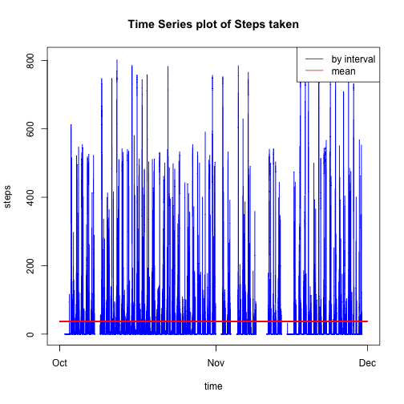

# Assignment1
###Author: Bo Wu
###You can contact me through jose29guoan@gmail.com

## Loading and preprocessing the data
First, we can read the csv into R by read.csv function. And then, I create a POSIXct vector a$dt, which is designed for further analysis.

```r
a <- read.csv(file = "activity.csv" , as.is =TRUE)
```

```
## Warning in file(file, "rt"): cannot open file 'activity.csv': No such file
## or directory
```

```
## Error in file(file, "rt"): cannot open the connection
```

```r
a$date<-as.Date(a$date)
a$h <- floor(a$interval/100)
a$m <- a$interval-100*a$h
a$dt <- as.POSIXct(paste(a$date,a$h,a$m,sep=":"),format="%Y-%m-%d:%H:%M")
head(a)
```

```
##   steps       date interval h  m                  dt
## 1    NA 2012-10-01        0 0  0 2012-10-01 00:00:00
## 2    NA 2012-10-01        5 0  5 2012-10-01 00:05:00
## 3    NA 2012-10-01       10 0 10 2012-10-01 00:10:00
## 4    NA 2012-10-01       15 0 15 2012-10-01 00:15:00
## 5    NA 2012-10-01       20 0 20 2012-10-01 00:20:00
## 6    NA 2012-10-01       25 0 25 2012-10-01 00:25:00
```

## What is mean total number of steps taken per day?
A summary of daily step is shown as below:

```r
sum_by_day <- tapply(X=a$steps,INDEX = a$date , FUN=sum,na.rm=TRUE)
hist(sum_by_day,col="blue",xlab = 'Steps' , main = 'Summary of Steps Taken per Day')
```

 

```r
(mean_day <- mean(sum_by_day,na.rm=TRUE))
```

```
## [1] 9354.23
```

```r
(median_day <- median(sum_by_day,na.rm=TRUE))
```

```
## [1] 10395
```
As can be seen, mean daily step is 9354.2295082, and median is 10395.

## What is the average daily activity pattern?

```r
avg_by_5_min <- mean(a$steps,na.rm = TRUE)
plot(a$dt,a$steps,type="l",col="blue",xlab = "time" , ylab = "steps", main = "Time Series plot of Steps taken")
lines(a$dt,rep(avg_by_5_min,length(a$steps)),type="l",col="red")
legend("topright",c("by interval","mean"),col=c("blue","red"),lty=1)
```

 

In fact, I don't think just plot average interval steps make much sense. So I plot steps per interval meanwhile. 

```r
(top_interval<-a$dt[which.max(a$steps)])
```

```
## [1] "2012-11-27 06:15:00 PST"
```

```r
(beginning_top_interval<-a$dt[which.max(a$steps)-1])
```

```
## [1] "2012-11-27 06:10:00 PST"
```
The interval with the largest amount of step is 2012-11-27 06:15:00. So the 5-minute period is from 2012-11-27 06:10:00 to 2012-11-27 06:15:00.

## Imputing missing values

```r
(total_nas=sum(is.na(a$steps)))
```

```
## [1] 2304
```

There are 2304 in the data. To fill them,I just used the most lazy method, which is to assign as the average of non-missing value. Following code to achieve this target:(b is the newly created data.frame)

```r
b<-a
for(i in 1:length(b$steps)){
        if(is.na(b$steps[i])){
                b$steps[i]<-avg_by_5_min
        }
}
head(b)
```

```
##     steps       date interval h  m                  dt
## 1 37.3826 2012-10-01        0 0  0 2012-10-01 00:00:00
## 2 37.3826 2012-10-01        5 0  5 2012-10-01 00:05:00
## 3 37.3826 2012-10-01       10 0 10 2012-10-01 00:10:00
## 4 37.3826 2012-10-01       15 0 15 2012-10-01 00:15:00
## 5 37.3826 2012-10-01       20 0 20 2012-10-01 00:20:00
## 6 37.3826 2012-10-01       25 0 25 2012-10-01 00:25:00
```

```r
sum_by_day_b <- tapply(X=b$steps,INDEX = b$date , FUN=sum,na.rm=TRUE)
hist(sum_by_day_b,col="red",xlab = 'Adjusted Steps' , main = 'Adjusted Summary of Steps Taken per Day')
```

 

```r
(mean_day_b <- mean(sum_by_day_b,na.rm=TRUE))
```

```
## [1] 10766.19
```

```r
(median_day_b <- median(sum_by_day_b,na.rm=TRUE))
```

```
## [1] 10766.19
```
As can be seen, the new mean daily step is 1.0766189 &times; 10<sup>4</sup>, and median is 1.0766189 &times; 10<sup>4</sup>.


```r
par(mfrow=c(1,2))
hist(sum_by_day,col="blue",xlab = 'Steps' , main = 'Summary of Steps')
hist(sum_by_day_b,col="red",xlab = 'Adjusted Steps' , main = 'Adjusted Summary of Steps')
```

 

## Are there differences in activity patterns between weekdays and weekends?
At first, I created a function to generate a factor variable, which indicates that whether a certain observation is on a weekday or weekend. And then, I used lattice system to do the plot.

```r
gen_weekday_weekend <- function(x){
        f<-factor(weekdays(x))
        levels(f)[levels(f) %in% c("Monday","Tuesday","Wednesday","Thursday","Friday")]<-"weekday"
        levels(f)[levels(f) %in% c("Saturday","Sunday")]<-"weekend"
        f
}
library(lattice)
xyplot(a$steps ~ a$dt | gen_weekday_weekend(a$date),layout = c(1,2) ,type="l",xlab = 'Interval' , ylab = "Number of Steps")
```

 
